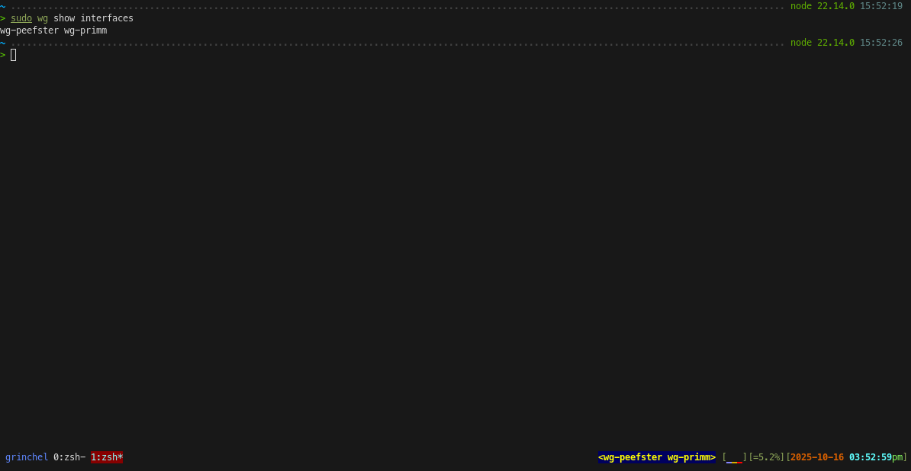
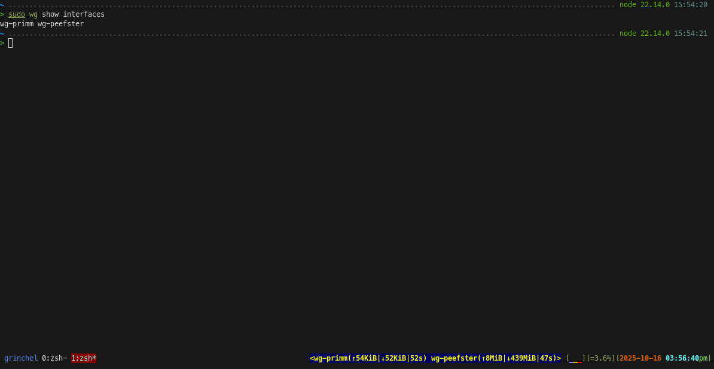

# tmux WireGuard status

tmux plugin to add active WireGuard interfaces to your status bar.

## Pre-requisites

- `wg` (from `wireguard-tools`)
- `numfmt` (from `coreutils`)
- For verbose mode (to show network transfer, etc), the ability to run `sudo wg show`
  without a password (example sudoers config below)

## Installation

### Via TPM (recommended)

```
set -g @plugin 'mgalgs/tmux-wireguard'
```

Hit `prefix + I` to fetch the plugin and source it.

Now you can add `#{@active_wg_ifs}` or `#{@active_wg_ifs_verbose}` to your
`status-left` and `status-right` options, as described in the Usage section
below.

### Manual

Clone the repo:

```
git clone https://github.com/mgalgs/tmux-wireguard
```

Add this to the bottom of your `.tmux.conf`:

```
run-shell /path/to/tmux-wireguard/main.tmux
```

And reload your tmux environment:

```
tmux source-file ~/.tmux.conf
```

## Usage

This plugin adds the following variables for use in your `status-left` or
`status-right` strings:

  - `#{@active_wg_ifs}` :: Space-separated list of WireGuard interface names
  - `#{@active_wg_ifs_verbose}` :: Verbose list of interfaces, including data
    transfer (summed across all peers) and last handshake (from most recent peer)

### Example

```
set -g status-right '#[fg=colour226,bg=colour017,bright]#{@active_wg_ifs_verbose}#[fg=green,bg=black,nobright] #[default]'
```

## Screenshots

These were taken with the colors from the above `status-right` example.

Normal mode:



Verbose mode:



## Password-less sudo Configuration

Since `wg show` requires root access and this script is called non-interactively by
tmux, you need to enable password-less `sudo` access for the `wg show` command.

For example, to allow any user in the `sudo` group to run `wg show` without a
password you can add the following entry to your sudoers file (which you can edit by
running `sudo visudo`):

```
%sudo ALL=(ALL) NOPASSWD: /usr/bin/wg show
```

(replace `%sudo` with `username` to target a specific user, or `%othergroup` to
target a different group).

To keep things organized and separate from your distro's sudo configuration you can
drop that in a dedicated file by running `sudo visudo -f /etc/sudoers.d/wg` and
adding the line there.
